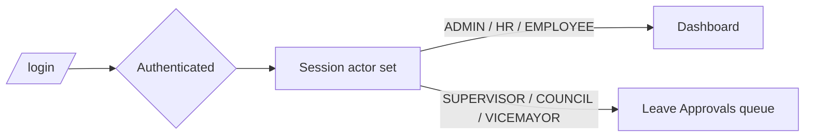
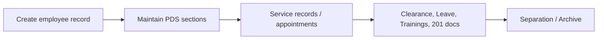
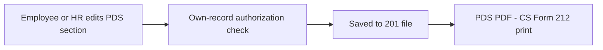
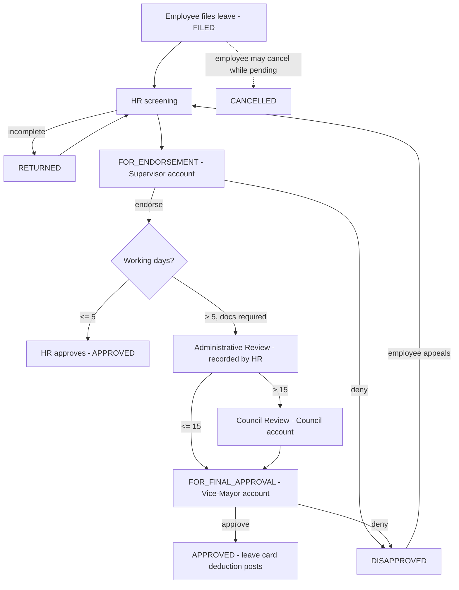
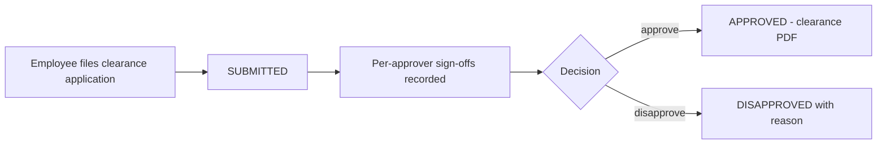
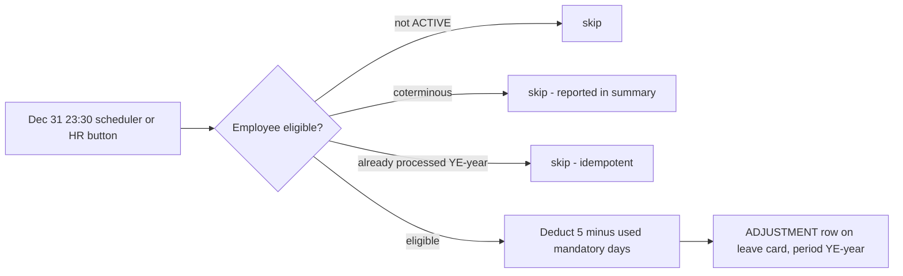

# HRIS Process Flows — All Modules

City Council of Manila — Human Resource Information System.
Requested under CR Request ID 016 (revision 2): *"HRIS Process flow for all
modules and features for documentation."* Current as of July 2026 (post
CR-015 / CR-016 v2 / CR-017).

---

## 1. Login, Accounts & Roles

Login accounts are `employee` records with a username, password (BCrypt) and a
single role (`user_type`). Legacy plain-text passwords are automatically
re-encoded with BCrypt on the next successful login.

| Role | Purpose | Landing page |
|---|---|---|
| ROLE_ADMIN | Full system administration | Dashboard |
| ROLE_HR | HR records management, leave screening, every workflow stage | Dashboard |
| ROLE_EMPLOYEE | Self-service: own PDS, clearance, service record, leave | Dashboard (My Account menu) |
| ROLE_SUPERVISOR *(CR 016 v2)* | Endorses/denies leaves awaiting endorsement | Leave Approvals |
| ROLE_COUNCIL *(CR 016 v2)* | Secretary to the City Council — Council Review of > 15-day leaves | Leave Approvals |
| ROLE_VICEMAYOR *(CR 016 v2)* | Final approval/denial of > 5-day leaves | Leave Approvals |

Admins assign roles and reset passwords from **Employee List → credentials**.
Password self-service is at **/change-password**.

## 2. Employee Records (201 File core)

Admin maintains the employee master list (Employee List): create employee,
edit records, upload photo, set login credentials and role, status
(ACTIVE / resigned etc.), plantilla/appointment details.

## 3. Personal Data Sheet (PDS, CS Form 212)

Every PDS section (Family Background, Educational Background, Civil Service
Eligibility, Work Experience, Voluntary Work, Learning & Development, Other
Information, References, Government IDs) supports admin editing and employee
self-service on the employee's own record (server-enforced own-record guard).

- Long dropdowns are searchable combos (CR-015); Office Name on Work
  Experience and City in addresses accept free-typed values (CR-015/017).
- PDS prints to the CS Form 212 PDF; empty fields print "N/A" (CR-015).

## 4. Leave Management (CR 016 v2 decision flow)

Full detail incl. per-role authorization, docs gate, receipts, balances:
`docs/leave/LEAVE_PROCESS_FLOW.md`.

- Actors are notified in-app when a leave enters their stage; employees are
  notified of every decision and may **appeal** (disapproved) or **cancel**
  (pending) from My Leave Record.
- Balances live on the leave-card ledger; deduction posts only at APPROVED.
- Monthly accrual (1.25 VL / 1.25 SL) is posted by HR per employee.
- **Year-end mandatory deduction**: every Dec 31 (and on demand) the unused
  portion of the 5 mandatory/forced leave days is deducted for all employees
  **except coterminous**; idempotent per year.
- Leave Tracker shows a calendar of approved leaves. CS Form 6 PDF prints the
  application with the recorded (or acting) signatories.

## 5. Clearance

Employees file from **My Clearance**; HR/Admin process from **Clearance
List** and maintain the approver/signatory settings (Approvers screen).

## 6. Service Records & Appointments

HR maintains per-employee service records (position, office, salary, period)
and appointment papers. Employees view their own via **My Service Record** /
**My Appointments**. Prints the CSC Service Record form.

## 7. Training & Seminar (CR-015)

HR records trainings/seminars per employee (title, provider, hours, dates,
certificates via file upload). Feeds the PDS Learning & Development section.

## 8. 201 Files & Archive (CR-015)

- **201 Files**: per-employee document uploads by document type.
- **Archive** (HR/Admin only): SALN files, Resigned-employee files, and past
  Leave documents, organized per folder with uploads/downloads.

## 9. Notifications

In-app notification bell (navbar) for every account; unread badge, mark-read
on open. Producers today: the leave decision flow (employee + per-stage actor
+ HR alerts). Notifications are session-scoped — a user only ever sees their
own.

## 10. Reports & PDF Exports

Jasper-based PDFs: PDS (CS Form 212), CS Form 6 (leave application), Leave
Card, Leave Verification Receipt, Clearance, Service Record, Report on
Separation, individual employee reports.

## 11. System Settings (lookup maintenance, Admin)

CRUD screens for: Departments, Divisions, Offices, Districts, Position Titles
(+ Position Description Forms), Salary Grades, Levels, Employee Status,
Appointment Status, Civil Status, Degree Courses/Levels, Academic Honors,
Schools, Scholarships, Professions, Eligibilities, Document Types, Learning
Types, Leave Types, Holidays, and the Leave Endorsement/Signatory defaults.

- **Employee Status** drives the year-end coterminous exclusion
  (status name containing "COTERM").
- **Leave signatories** hold the default names printed on CS Form 6; each
  workflow action can still override them for acting officials.

## 12. Year-End Processing

