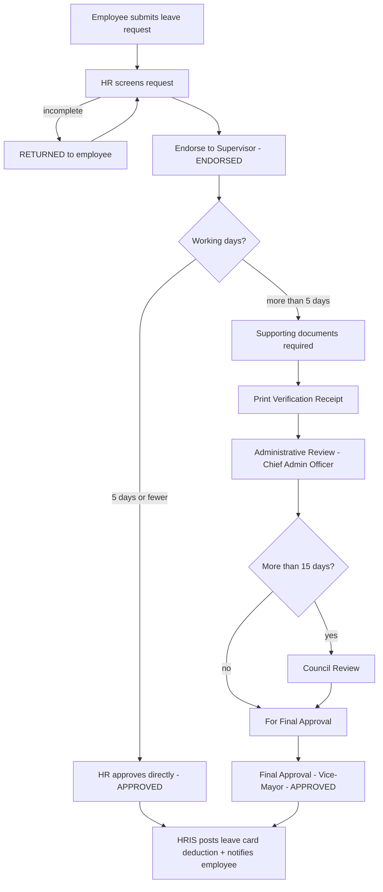

# HRIS Leave Module — Process Flow (CR Request ID 016)

Documented for the City Council of Manila HRIS. Covers the multi-stage Leave
Decision Flow introduced by Change Request ID 016 (submitted July 16, 2026 by
the Administrative Division), plus the employee notification, appeal/cancel and
year-end mandatory leave policies.

## 1. Roles

| Role in the flow | Who acts in HRIS |
|---|---|
| Employee | Files, cancels and appeals their own leave via **My Leave Record** |
| HR / Admin (ROLE_HR, ROLE_ADMIN) | Screens requests and records every workflow stage on behalf of the physical signatories |
| Supervisor, Chief Admin Officer, Council, Vice-Mayor | Physical signatories — their decisions are recorded in HRIS by HR with name, title, date and remarks (no separate logins) |

## 2. Leave decision flow

There is **no accept/approve button upon submission**: a newly filed request
only offers *Endorse to Supervisor* or *Return to Employee*. Approval becomes
possible only after endorsement, and for leaves over 5 working days only after
the full review chain.

## 3. Statuses and transitions

Pending statuses: `FILED`, `APPEALED`, `RETURNED`, `ENDORSED`,
`FOR_ADMIN_REVIEW`, `FOR_COUNCIL_REVIEW`, `FOR_FINAL_APPROVAL`.
Final statuses: `APPROVED`, `DISAPPROVED`, `CANCELLED`.

| From | Action (actor) | To | Gate |
|---|---|---|---|
| FILED / APPEALED | Return (HR) | RETURNED | remarks required |
| FILED / APPEALED / RETURNED | Endorse to Supervisor (HR) | ENDORSED | signatory name required |
| ENDORSED | Approve (HR) | APPROVED | only ≤ 5 working days — posts leave card deduction |
| ENDORSED | Forward for Administrative Review (HR) | FOR_ADMIN_REVIEW | only > 5 days **and** supporting documents attached |
| FOR_ADMIN_REVIEW | Administrative Review passed (CAO) | FOR_COUNCIL_REVIEW if > 15 days, else FOR_FINAL_APPROVAL | server picks the target — Council Review cannot be skipped |
| FOR_COUNCIL_REVIEW | Council Review passed | FOR_FINAL_APPROVAL | — |
| FOR_FINAL_APPROVAL | Final Approval (Vice-Mayor) | APPROVED | posts leave card deduction |
| any review stage | Disapprove | DISAPPROVED | reason required |
| any pending status | Cancel (**employee**) | CANCELLED | owner only |
| DISAPPROVED | Appeal (**employee**) | APPEALED | owner only — re-enters HR screening |
| APPROVED | Reopen (staff, corrective) | ENDORSED | audit-logged; deduction is automatically reversed |

Every transition is recorded in the `leave_workflow_action` audit table
(acting HRIS user, signatory, remarks, timestamp) and visible in the Workflow
panel history. Status can **only** change through the Workflow panel — the
Edit modal no longer has a status dropdown, and a tampered status in the
update request is discarded server-side.

## 4. Leave balances

- Balances are computed from the Employee's Leave Card ledger; they are never
  stored directly.
- The ledger deduction posts **only at APPROVED** (short path: HR approval;
  long path: Vice-Mayor final approval). Vacation and Mandatory/Forced Leave
  deduct VL; Sick Leave deducts SL; every other type is recorded without
  deduction.
- Reopening or un-approving an application automatically removes its ledger
  row, restoring the credits.
- Monthly accrual (1.25 VL / 1.25 SL) remains a manual HR action per employee.

## 5. Supporting documents & verification receipt (> 5-day leaves)

- Employees may attach documents when filing; HR can attach received hard
  copies from the Workflow panel. Files are stored through the standard HRIS
  file storage (`/file/download/...`).
- A > 5-day request **cannot** be forwarded for Administrative Review until at
  least one document is attached.
- HR prints the **Leave Verification Receipt** (PDF) from the Workflow panel;
  each print is logged in the workflow history.

## 6. Employee notifications

Employees receive in-app notifications (navbar bell) when their request is
endorsed, forwarded, returned, approved, disapproved, cancelled or appealed.
Unread notifications show a badge; opening the bell marks them read. Each
notification links back to **My Leave Record**.

## 7. Appeal and cancellation

- **Cancel**: available to the employee on any still-pending application
  (button on My Leave Record). Approved/disapproved applications cannot be
  cancelled by the employee.
- **Appeal**: available on a DISAPPROVED application; it moves to APPEALED and
  re-enters HR screening.

## 8. Year-end mandatory 5-day leave deduction

At the end of each year every employee's remaining balance is reduced by the
**unused portion** of the five (5) mandatory/forced leave days:

- Used = total working days of APPROVED *Mandatory/Forced Leave* applications
  starting within the year.
- Deduction = `5 − used` (never negative). Example: 3 forced-leave days used →
  2 days deducted; all 5 used → nothing deducted.
- Posted as an ADJUSTMENT leave card row dated Dec 31 with period `YE-<year>`,
  which is also the idempotency guard: re-running skips employees already
  processed. HR must not use the `YE-` prefix in manual adjustment periods.
- Runs automatically every December 31, 23:30 (Asia/Manila) and on demand from
  **Leave Applications → Year-End Mandatory/Forced Leave Processing** (any
  year can be selected, e.g. to run a missed prior year).

## 9. Navigation

- **Employee**: My Account → My Leave Record (own applications, filing,
  cancel/appeal; balances are not shown to employees).
- **HR/Admin**: Employee Management → **Leave Applications** (decision-flow
  queue — also the target of the dashboard quick-nav and its "New" badge,
  which counts every application still in the flow), **Leave Management**
  (per-employee records and leave cards), **Leave Tracker** (calendar of
  approved leaves).

## 10. Deployment note

Production runs with `spring.jpa.hibernate.ddl-auto=none`. Before deploying
CR-016, apply `docs/deployment/sql/CR016_leave_workflow_migration.sql`
(creates `leave_workflow_action`, `notification`,
`leave_application_supporting_doc_urls`; additive only, safe to re-run).
