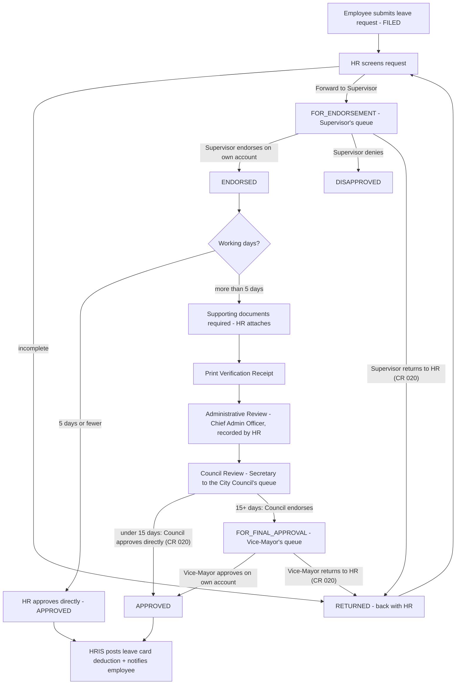

# HRIS Leave Module — Process Flow (CR Request ID 016, revision 2; updated by CR 020)

Documented for the City Council of Manila HRIS. Covers the multi-stage Leave
Decision Flow introduced by Change Request ID 016 (submitted July 16, 2026 by
the Administrative Division) as amended by its revision 2 (actor accounts),
plus the employee notification, appeal/cancel and year-end mandatory leave
policies. CR Request ID 020 (July 21, 2026) added mid-flow "return to HR" for
the Supervisor and Vice-Mayor stages, and let the Council Secretary finalize
leaves under the Council threshold herself instead of always forwarding to
the Vice-Mayor.

## 1. Roles

| Role in the flow | Who acts in HRIS |
|---|---|
| Employee (ROLE_EMPLOYEE) | Files, cancels and appeals their own leave via **My Leave Record** |
| HR / Admin (ROLE_HR, ROLE_ADMIN) | Screens requests, attaches supporting documents, records the Administrative Review (Chief Admin Officer) stage, and may record **any** stage on behalf of an acting signatory |
| Supervisor (ROLE_SUPERVISOR) — **own account (CR 016 v2)** | Endorses, denies, or returns to HR (CR 020, e.g. missing documents) leaves in their queue (status FOR_ENDORSEMENT). The queue is global: every supervisor account sees all leaves awaiting endorsement |
| Secretary to the City Council (ROLE_COUNCIL) — **own account (CR 016 v2)** | Reviews every docs-required leave (CR 020: Council Review is no longer skipped for shorter leaves); finalizes it herself if under 15 working days, otherwise endorses it on to the Vice-Mayor |
| Vice-Mayor (ROLE_VICEMAYOR) — **own account (CR 016 v2)** | Final approval, denial, or return-to-HR (CR 020) for leaves of 15 or more working days |
| Chief Admin Officer | Physical signatory only — the Administrative Review decision is recorded by HR (no account, per the CR) |

Each actor account is **notified in-app when a leave enters their stage** and
acts from **Leave Approvals** (their pending queue). Signatory name/title stays
editable on every action so an acting official can sign in place of the
default one.

## 2. Leave decision flow

There is **no accept/approve button upon submission**: a newly filed request
only offers *Endorse to Supervisor* or *Return to Employee*. Approval becomes
possible only after endorsement, and for leaves over 5 working days only after
the full review chain.

## 3. Statuses and transitions

Pending statuses: `FILED`, `APPEALED`, `RETURNED`, `FOR_ENDORSEMENT` (v2),
`ENDORSED`, `FOR_ADMIN_REVIEW`, `FOR_COUNCIL_REVIEW`, `FOR_FINAL_APPROVAL`.
Final statuses: `APPROVED`, `DISAPPROVED`, `CANCELLED`.

| From | Action (actor) | To | Gate |
|---|---|---|---|
| FILED / APPEALED | Return (HR) | RETURNED | remarks required |
| FILED / APPEALED / RETURNED | **Forward to Supervisor (HR screening)** | FOR_ENDORSEMENT | v2 — notifies all supervisor accounts |
| FILED / APPEALED / RETURNED | Supervisor Endorsement (HR, on behalf) | ENDORSED | legacy/acting fallback; signatory name required |
| FOR_ENDORSEMENT | **Supervisor Endorsement (Supervisor account or HR)** | ENDORSED | signatory name required (prefilled with the supervisor's own name) |
| FOR_ENDORSEMENT | Disapprove (Supervisor account or HR) | DISAPPROVED | reason required |
| FOR_ENDORSEMENT | **Return to HR (Supervisor account or HR, CR 020)** | RETURNED | remarks required, e.g. missing documents |
| ENDORSED | Approve (HR) | APPROVED | only ≤ 5 working days — posts leave card deduction |
| ENDORSED | Forward for Administrative Review (HR) | FOR_ADMIN_REVIEW | only > 5 days **and** supporting documents attached |
| FOR_ADMIN_REVIEW | Administrative Review passed (CAO, recorded by HR) | FOR_COUNCIL_REVIEW | server always routes through Council Review (CR 020) — no longer skipped for shorter leaves |
| FOR_COUNCIL_REVIEW | **Council Final Approval (Council account or HR, CR 020)** | APPROVED | only < 15 working days — posts leave card deduction |
| FOR_COUNCIL_REVIEW | **Council Review passed (Council account or HR)** | FOR_FINAL_APPROVAL | only ≥ 15 working days |
| FOR_FINAL_APPROVAL | **Final Approval (Vice-Mayor account or HR)** | APPROVED | posts leave card deduction |
| FOR_FINAL_APPROVAL | **Return to HR (Vice-Mayor account or HR, CR 020)** | RETURNED | remarks required |
| any review stage | Disapprove (stage's actor or HR) | DISAPPROVED | reason required |
| any pending status | Cancel (**employee**) | CANCELLED | owner only |
| DISAPPROVED | Appeal (**employee**) | APPEALED | owner only — re-enters HR screening; HR is notified |
| APPROVED | Reopen (staff, corrective) | ENDORSED | audit-logged; deduction is automatically reversed |

**Per-role authorization (v2):** a dedicated actor account may act **only**
while the application sits at its own stage — Supervisor at FOR_ENDORSEMENT,
Council at FOR_COUNCIL_REVIEW, Vice-Mayor at FOR_FINAL_APPROVAL. ROLE_HR /
ROLE_ADMIN may act at every stage (acting-official fallback). Employees can
never call workflow actions.

Every transition is recorded in the `leave_workflow_action` audit table
(acting HRIS user, signatory, remarks, timestamp) and visible in the Workflow
panel history. Status can **only** change through the Workflow panel — the
Edit modal no longer has a status dropdown, and a tampered status in the
update request is discarded server-side.

## 4. Leave balances

- Balances are computed from the Employee's Leave Card ledger; they are never
  stored directly.
- The ledger deduction posts **only at APPROVED** (short path: HR approval;
  long path: Council final approval under 15 days, or Vice-Mayor final
  approval at 15+ days). Vacation and Mandatory/Forced Leave
  deduct VL; Sick Leave deducts SL; every other type is recorded without
  deduction.
- Reopening or un-approving an application automatically removes its ledger
  row, restoring the credits.
- Monthly accrual (1.25 VL / 1.25 SL) remains a manual HR action per employee.

## 5. Supporting documents & verification receipt (> 5-day leaves)

- Employees may attach documents when filing; HR can attach received hard
  copies from the Workflow panel. Files are stored through the standard HRIS
  file storage (`/file/download/...`).
- A > 5-day request **cannot** be forwarded for Administrative Review until at
  least one document is attached.
- HR prints the **Leave Verification Receipt** (PDF) from the Workflow panel;
  each print is logged in the workflow history.

## 6. Notifications

**Employees** receive in-app notifications (navbar bell) when their request is
screened, endorsed, forwarded, returned, approved, disapproved, cancelled or
appealed. Each notification links back to **My Leave Record**.

**Workflow actors (v2)** are notified on their own accounts when a leave
enters their stage: supervisors on Forward to Supervisor, the Council
secretary whenever any docs-required leave passes Administrative Review
(CR 020: every such leave now reaches Council Review, not just >15-day
ones), the Vice-Mayor when a leave of 15+ working days reaches Final
Approval. **HR** is notified when a new application is filed or an appeal is
submitted; a Supervisor/Vice-Mayor return-to-HR (CR 020) relies on HR's
existing full-queue visibility rather than a separate push notification.
Actor notifications link to the employee's leave record page.

Unread notifications show a badge; opening the bell marks them read.

## 7. Appeal and cancellation

- **Cancel**: available to the employee on any still-pending application
  (button on My Leave Record). Approved/disapproved applications cannot be
  cancelled by the employee.
- **Appeal**: available on a DISAPPROVED application; it moves to APPEALED and
  re-enters HR screening.

## 8. Year-end mandatory 5-day leave deduction

At the end of each year every employee's remaining balance is reduced by the
**unused portion** of the five (5) mandatory/forced leave days:

- **All employees except coterminous** are deducted (v2): employees whose
  Employee Status is COTERMINOUS (any spelling — CO-TERMINOUS etc.) are
  excluded and reported in the run summary.
- Used = total working days of APPROVED *Mandatory/Forced Leave* applications
  starting within the year.
- Deduction = `5 − used` (never negative). Example: 3 forced-leave days used →
  2 days deducted; all 5 used → nothing deducted.
- Posted as an ADJUSTMENT leave card row dated Dec 31 with period `YE-<year>`,
  which is also the idempotency guard: re-running skips employees already
  processed. HR must not use the `YE-` prefix in manual adjustment periods.
- Runs automatically every December 31, 23:30 (Asia/Manila) and on demand from
  **Leave Applications → Year-End Mandatory/Forced Leave Processing** (any
  year can be selected, e.g. to run a missed prior year).

## 9. Navigation

- **Employee**: My Account → My Leave Record (own applications, filing,
  cancel/appeal; balances are not shown to employees). Clicking the leave
  navigation item lands directly on the employee's submitted applications.
- **Supervisor / Council Secretary / Vice-Mayor (v2)**: **Leave Approvals**
  (their pending queue — also where they land after login). From a queue row
  they open the employee's leave record in review-only mode: Workflow actions
  for their stage plus Form 6 PDF, but no editing, deleting, accrual posting
  or document upload.
- **HR/Admin**: Employee Management → **Leave Applications** (decision-flow
  queue — also the target of the dashboard quick-nav and its "New" badge,
  which counts every application still in the flow), **Leave Management**
  (per-employee records and leave cards), **Leave Tracker** (calendar of
  approved leaves). HR also gets the **Leave Approvals** shortcut.

## 10. Actor accounts (v2)

Seeded by `docs/deployment/sql/CR016_v2_actor_accounts.sql`: `supervisor`
(ROLE_SUPERVISOR), `council_sec` (ROLE_COUNCIL), `vice_mayor`
(ROLE_VICEMAYOR), each with a temporary password to be changed at handover.
Admins can also assign these roles to any existing employee record from
Employee List → credentials (multiple supervisor accounts are supported; the
endorsement queue is global). The seeded service accounts use employee status
`N/A`, keeping them out of the year-end deduction and other active-employee
sweeps.

## 11. Deployment note

Production runs with `spring.jpa.hibernate.ddl-auto=none`. Before deploying
CR-016, apply `docs/deployment/sql/CR016_leave_workflow_migration.sql`
(creates `leave_workflow_action`, `notification`,
`leave_application_supporting_doc_urls`; additive only, safe to re-run).
For revision 2, additionally apply
`docs/deployment/sql/CR016_v2_actor_accounts.sql` (accounts only, no DDL,
safe to re-run). See also the all-modules overview in
`docs/HRIS_PROCESS_FLOWS.md`.
